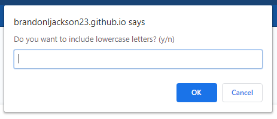
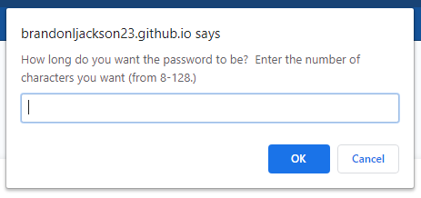
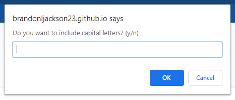
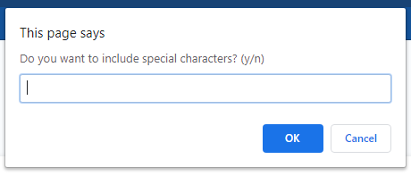
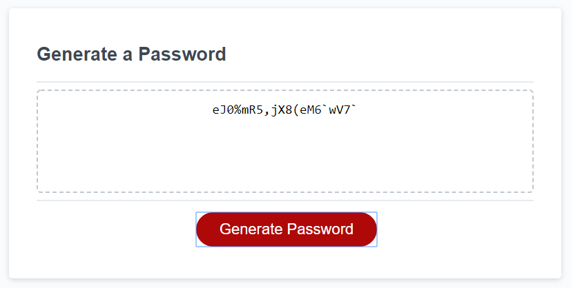
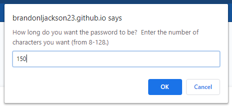
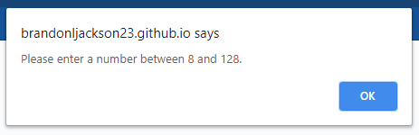

# Password Generator

## Purpose
A website that allows a user to create a random password.

## Website
https://brandonljackson23.github.io/password-generator/

## Overview
When requesting a new password the user will be able to customize the password based on their preferences for password length and whether to include any or all of the following caharacter types:

-lowercase letters
-uppercase letters
-numbers
-special characters

When the user clicks on the Generate Passwoard button, they will navigate through a series of prompts asking them for their preferences.  If the user enters an unacceptable value on any of the prompts the user will be notified and given another chance to enter their input.  Once the user has successfully entered all their preferences a new random password will be generated and displayed in the Generate a Password text area.

## Workflow
Below is a depiction using screenshots of the workflow that a user would follow to generate a new password:

First, the user click the Generate Password button.

Second, the user enters how many characters they would the password to be.

Third, the user selects whether to include lowercase letters or not.

Fourth, the user selects whether to include capital (uppercase) letters or not.

Fifth, the user selects whether to include special characters or not.

Last, the user sees the new passwoard displayed on the screen.

## Validation

If on any of the prompts the user enters an unacceptable value, they will be notified and redirected to re-enter a value.  Here is an example:

If a user enters a value for the length that is below 8 or above 128:

They will be notified that they need to enter a value between 8 and 128:

Then the user is redirected to re-enter a value.

The same flow of validation is used on each prompt to validate the input the user enters for each of thier preferences (lowercase letter, uppercase letters, special characters.)

